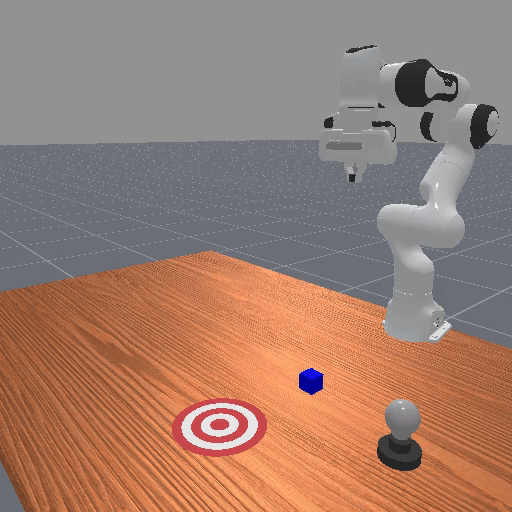

# VLA Memory dependence BenchMark: ManiSkill Platform

<div align="center">

[](https://www.python.org/downloads/)
[](LICENSE)
[](https://maniskill.readthedocs.io/en/latest/)
[](#)

*A comprehensive memory dependence robot benchmark across 4 manipulation tasks from different memory dimension*

</div>

## 📦 Installation

### Prerequisites
- Python 3.10 or higher
- CUDA-compatible GPU (recommended)
- 8GB+ RAM

### Installation

1. **Clone the repository**
   ```bash
   git clone https://github.com/cytoplastm/VLA_Memory_dependence_benchmark.git
   cd Memory_dependence_benchmark
   ```

2. **Create conda virtual environment**
   ```bash
   conda create -n memory_dependence_benchmark python=3.10
   conda activate memory_dependence_benchmark
   ```

3. **Install dependencies**
   ```bash
   pip install -r requirements.txt
   pip install -e .
   ```

4. **Data generation**
   ```bash
   bash mani_skill/examples/motionplanning/panda/collectdata.sh

   #Convert trajectory data from joint control to relative end-effector control.
   bash mani_skill/trajectory/replay.sh
   ```

5. **Convert to LeRobot format (Optional)**

   > ⚠️ **Note:** This step requires the [LeRobot env](https://github.com/huggingface/lerobot).

   If you want to use the dataset with the LeRobot framework, please install the dependency and run the conversion script:
   ```bash
   python scripts/convert_maniskill_to_lerobot.py
   ```
   
### 🗄️ Download from Hugging Face
You can also download from [Hugging Face](https://huggingface.co/datasets/furry123/ManiSkill-Memory-dependence).

## 📊 Tasks Overview

Here are the demonstrations of the 4 manipulation tasks across different memory dimensions:

<div align="center">
    <div style="display: inline-block; margin: 10px; text-align: center;">
        <b>PickPlaceThreetimes-v1</b><br>
        
    </div>
    <div style="display: inline-block; margin: 10px; text-align: center;">
        <b>PushCubeWithSignal-v1</b><br>
        
    </div>
    <br>
    <div style="display: inline-block; margin: 10px; text-align: center;">
        <b>SwapThreeCubes-v1</b><br>
        
    </div>
    <div style="display: inline-block; margin: 10px; text-align: center;">
        <b>TeacherArmShuffle-v1</b><br>
        
    </div>
</div>
<p align="center"><i>Demonstrations of the 4 manipulation tasks across different memory dimensions</i></p>

## 🔧 Task Description

Each task in this benchmark is carefully designed to evaluate a specific dimension of memory dependence and temporal reasoning in robotic manipulation.

1. **PickPlaceThreetimes-v1 (Temporal Sequencing)**
   - **Objective:** The robot must perform a "pick-lift-reset" cycle for three colored cubes strictly in the order of **Red → Green → Blue**.
   - **Memory Challenge:** Introduces severe state aliasing. A static observation (e.g., a hovering gripper) cannot determine which blocks have already been manipulated. The agent must rely on historical keyframes to track sub-goal completion and prevent sequence violations.

2. **PushCubeWithSignal-v1 (Counting & Latency)**
   - **Objective:** A signal lamp flashes twice with a randomized interval. The agent must count these pulses and push the target cube **only after the second flash**.
   - **Memory Challenge:** Evaluates the capacity to maintain internal states during static intervals. Since the scene during the inter-flash gap is visually identical to the initial state, a Markovian policy fails. Persistent historical context is required.

3. **SwapThreeCubes-v1 (Spatial Reconfiguration)**
   - **Objective:** The agent must dismantle a vertical stack of three randomly ordered blocks and reconstruct them in a newly permuted sequence.
   - **Memory Challenge:** Focuses on the "destruction-reconstruction" cycle. Once disassembled, the initial relative order is permanently lost from current visual observations. The agent must recall the initial configuration frame to execute the correct re-stacking sequence.

4. **TeacherArmShuffle-v1 (Identity Tracking)**
   - **Objective:** Three visually identical red blocks are aligned, and an auxiliary teacher arm rapidly swaps two of them. The agent must pick the specific block that was **originally in the center**.
   - **Memory Challenge:** Since the objects are visually identical, the target's identity is defined solely by its history. The model must perform object constancy reasoning by retrieving the exact historical frame of the swap event.

## 🙏 Acknowledgments

- [ManiSkill](https://maniskill.readthedocs.io/en/latest/) - Original framework
- [SAPIEN](https://sapien.ucsd.edu/) - Physics simulation engine
- [PyBullet](https://pybullet.org/) - Robot simulation
- All contributors and community members

## 📞 Contact

- **Project Maintainer**: [cytoplastm](https://github.com/cytoplastm)
- **Email**: [cytoplastm@126.com](mailto:cytoplastm@126.com)
- **Project Link**: https://github.com/cytoplastm/VLA_Memory_dependence_benchmark

